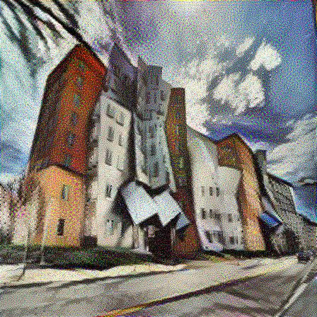
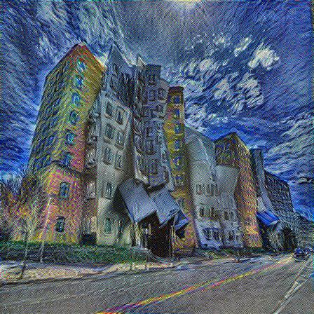
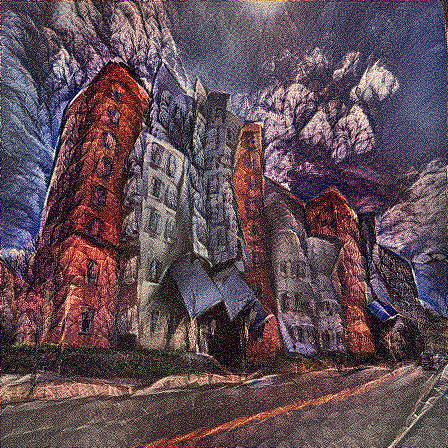
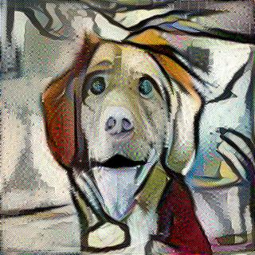
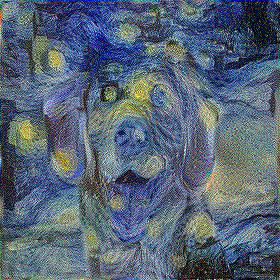
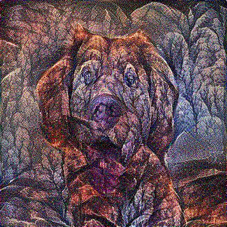
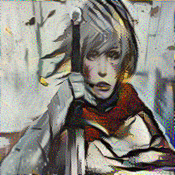
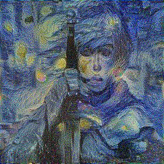
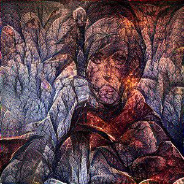

# Iterative-Neural-Style-Transfer
Tensorflow implementation of neural style transfer as proposed by Gatys et al.in the paper <a href="http://arxiv.org/abs/1508.06576">A Neural Algorithm of Artistic Style</a>

Sharing a simplified implementation of the style transfer algorithm. Code has been written and executed on GoogleCollab.

The below examples have been generated with 1000 iterations of Adam Optimizer (lr= 5.0 to 20.0) with content (_&alpha;_) and style (_&beta;_) weights set to roughly 1e1 and 1e-1 respectively.
The original paper mentioned that the ratio _&alpha;_/_&beta;_ was set to 1e-3, 1e-4 or 1e-5 but somehow I was not able to achieve good results with it.

Size of images ranged from 320x320 to 512x512 and took roughly 45-60 mins to train.

Different hyperparameter settings can be appropriate for different sets of images.

## Examples

### Content Images

<p align="center">


</p>

### Style Images

<p align="center">


</p>

### Generated Images

<p align="center">



</p>


<p align="center">



</p>

<p align="center">



</p>

### Usage
```
IMAGE_SIZE = <IMAGE_SIZE>
content_image_filename = <content_image_filename>
style_image_filename = <style_image_filename>
run_style_transfer(content_image_filename=content_image_filename,
                  style_image_filename=style_image_filename,
                  epochs=<number_of_epochs>,
                  learning_rate=<learning_rate>,
                  alpha=<content_weight>,
                  beta=<style_weight>
                  prefix=<prefix_of_generated_output_filenames>)
```

Example:
```
IMAGE_SIZE = 320
content_image_filename = './dog.jpg'
style_image_filename = './/starry_night.jpg'
run_style_transfer(content_image_filename=content_image_filename,
                  style_image_filename=style_image_filename,
                  epochs=1000,
                  learning_rate=10.0,
                  alpha=10,
                  beta=1e-1,
                  prefix='dog-starry_night')
``` 
